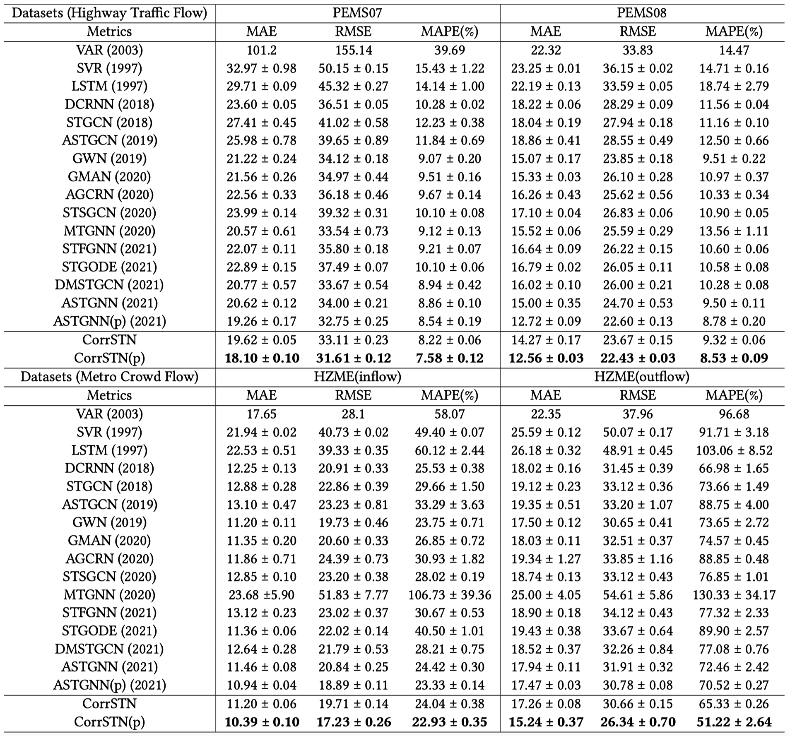

# CorrSTN


# Requirements
- python 3.6
- numpy == 1.19.5
- minpy == 1.2.5
- scikit-learn
- pytorch == 1.7.0

create CorrSTN env
```bash
conda create -n CorrSTN python=3.6
```

install pytorch
``` bash
conda install pytorch=1.7.0 torchvision torchaudio cudatoolkit=11.0 -c pytorch
```

install package for the maximal
information coefficient
```bash
pip install minepy==1.2.5
```

install other packages
```
conda install scikit-learn
pip install tensorboardX
```

# Train and Test

Step 1: Process dataset:
In the root folder, prepare training, test and validation data.
```python
python prepareData.py --config configurations/HZME_OUTFLOW_rdw.conf
```

In the `lib` folder, prepare `SCorr`. After the computing, move the result to each dataset folder.
```python
python corr.py
```

Step 2: train or test the model:

```python
python train_CorrSTN.py --config configurations/HZME_OUTFLOW_rdw.conf
```

prepare each dataset
```
python prepareData.py --config configurations/PEMS07.conf
python prepareData.py --config configurations/PEMS07_rdw.conf

python prepareData.py --config configurations/PEMS08.conf
python prepareData.py --config configurations/PEMS08_rdw.conf

python prepareData.py --config configurations/HZME_INFLOW.conf
python prepareData.py --config configurations/HZME_INFLOW_rdw.conf

python prepareData.py --config configurations/HZME_OUTFLOW.conf
python prepareData.py --config configurations/HZME_OUTFLOW_rdw.conf
```

train each dataset
```
python train_CorrSTN.py --config configurations/PEMS07.conf
python train_CorrSTN.py --config configurations/PEMS07_rdw.conf

python train_CorrSTN.py --config configurations/PEMS08.conf
python train_CorrSTN.py --config configurations/PEMS08_rdw.conf

python train_CorrSTN.py --config configurations/HZME_INFLOW.conf
python train_CorrSTN.py --config configurations/HZME_INFLOW_rdw.conf

python train_CorrSTN.py --config configurations/HZME_OUTFLOW.conf
python train_CorrSTN.py --config configurations/HZME_OUTFLOW_rdw.conf
```

# Model
The trained model wiil be stored in experiments/$DataSetName$ folder, such as `MAE_CorrSTN_h1d1w0_layer4_head8_dm64_channel1_dir2_drop0.00_1.00e-03_B16_K5_TcontextScaledSAtSE1TE`.

We also supply our trained model in experiments folder, such as `MAE_CorrSTN_h1d1w0_layer4_head8_dm64_channel1_dir2_drop0.00_1.00e-03_B16_K5_TcontextScaledSAtSE1TE-14.70-25.60-48.39`, where the last three digits are the metrics of MAE, RMSE and MAPE. Furthermore we also supply the training logs for each model.

HOW TO TEST:
1. delete the last three digits from our trained model folder, such as
 ```MAE_CorrSTN_h1d1w0_layer4_head8_dm64_channel1_dir2_drop0.00_1.00e-03_B16_K5_TcontextScaledSAtSE1TE-14.70-25.60-48.39```
to ```MAE_CorrSTN_h1d1w0_layer4_head8_dm64_channel1_dir2_drop0.00_1.00e-03_B16_K5_TcontextScaledSAtSE1TE```

2. uncomment the last line in `train_CorrSTN.py`,
```python
# train_main()
predict_main(0, test_loader, test_target_tensor, _max, _min, 'test')
```
 and change `0` to the epoch number to be tested.

# Results


# Some points to note
1. the batch sizes are different between the training phase and test and validation phase.

In the `lib/utils.py`,
```
line 537: val_loader = torch.utils.data.DataLoader(val_dataset, batch_size=batch_size * 32)
line 550: test_loader = torch.utils.data.DataLoader(test_dataset, batch_size=batch_size * 32)
```
so the batch size of test and validation phases is 32 times the batch size of training phases, which can improve the test speed.
