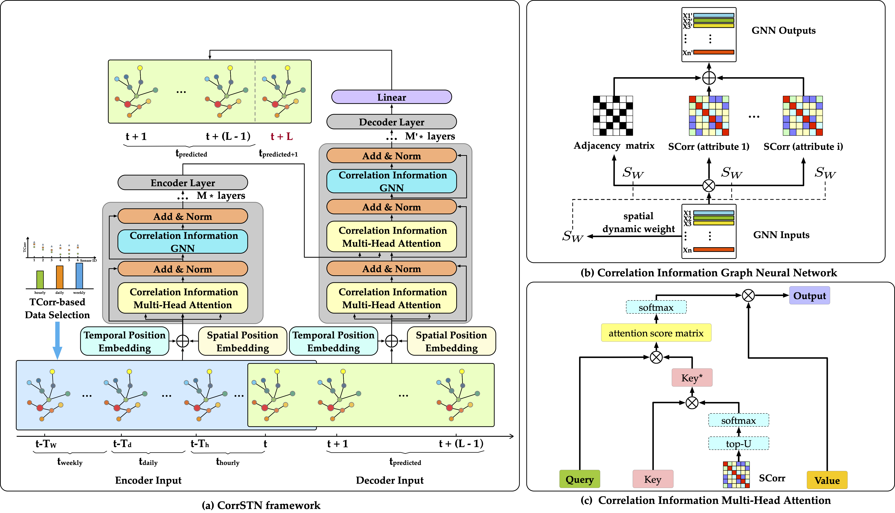

# CorrSTN



# Train and Test

Step 1: Process dataset:

```python
python prepareData.py --config configurations/HZME_OUTFLOW_rdw.conf
```

Step 2: train or test the model:

```python
python train_CorrSTN.py --config configurations/HZME_OUTFLOW_rdw.conf
```
